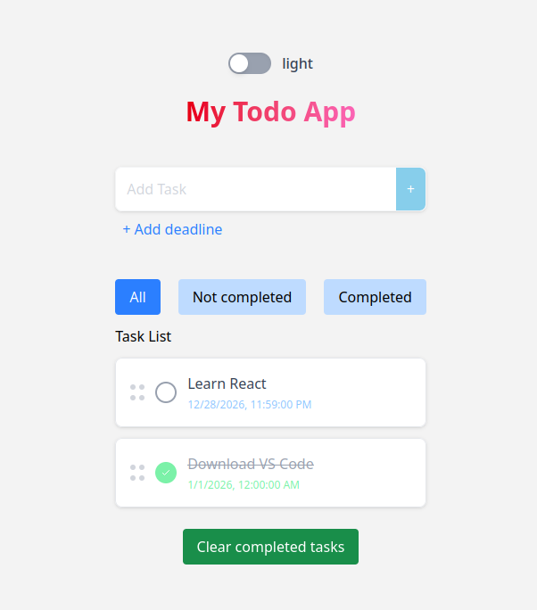

# React ToDo App

A feature-rich ToDo application built with React and Tailwind CSS for managing tasks efficiently.

## Screenshot



## Live Demo

Check out the working version of this app here:  
[https://mrubanenko.github.io/react-todolist](https://mrubanenko.github.io/react-todolist)

## Features

- Add, delete, and edit tasks  
- Add and modify task deadlines  
- Delete all completed tasks with one click  
- Task filtering: All / Active / Completed  
- Dark and light theme toggle  
- Drag & Drop to reorder tasks  
- Mock database simulation using MockAPI (server-like requests)  
- Reusable custom hooks and components  

## Tech Stack

- **React 18**  
- **Tailwind CSS**  
- **MockAPI**  
- LocalStorage for local state persistence  

## Installation & Running

Clone the repository and install dependencies:

```bash
git clone https://github.com/mrubanenko/todo-list-react.git
cd todo-list-react
npm install
npm run dev
